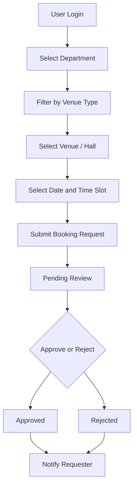

# VenueVerse Project Documentation

## Project Overview

VenueVerse is a React Native + Expo mobile app for college venue and hall booking. It lets selected department staff request venues, track approval status, and receive notifications. Admin and venue operations staff can manage halls, review booking requests, manage users, and monitor dashboard activity.

| Item | Current Status |
| --- | --- |
| Project name | VenueVerse |
| Purpose | College venue/hall booking and approval system |
| Platform | React Native + Expo mobile app with web preview support |
| Backend | Supabase Auth, Supabase PostgreSQL, Supabase Edge Functions |
| Target users | Department staff/users and admin/venue operations staff |
| Usage model | Selected staff accounts use the app as needed, usually one responsible account per department |
| Development status | Functional app in active development; auth, booking, admin operations, venue management, notifications, and department-level approvals are implemented, with production QA still required |

Related documentation:

- [Supabase Documentation](./SUPABASE_DOCUMENTATION.md)
- [API Reference](./API_REFERENCE.md)
- [Changelog](./CHANGELOG.md)
- [Future Roadmap](./FUTURE_ROADMAP.md)
- [Quick Start](./README.md)
- [Implementation Plan](./implementation_plan.md)
- [Profile Workflow](./profile_workflow.md)
- [Get Started Screen Notes](./GetStartedScreen.md)
- [Receipt Letterhead Template](./VenueVerse_Official_Booking_Receipt_Letterhead_Template.pdf)
- [Receipt Template](./VenueVerse_Official_Booking_Receipt_Template.pdf)
- [Alternate Onboarding Variant](./Alternate%20onboarding%20file%20(variant).txt) - draft/supporting note.
- [Get Started Animation Asset Notes](./Animation%20asset%20used%20getstarted.jso.txt) - supporting asset note.
- [To Be Updated](./to%20be%20updated.md) - draft/cleanup note, not authoritative.

## Role And Admin Workflow

- VenueVerse uses three roles: `super_admin`, `admin`, and `user`.
- The only allowed `super_admin` email is `venueverse.srec@gmail.com`.
- `super_admin` is a global cross-checking and management role.
- `super_admin` can view/manage all users, admins, departments, venues, and booking history.
- `super_admin` does not receive booking approval requests and is not a department approver.
- Each department has one admin and many users.
- Admins manage only users from their own `profiles.department`.
- Admins manage only venues from their own `halls.department`.
- Admin dashboard stats and booking history are scoped to venues in the admin department.
- Booking approval is based on venue department, not requester department.
- If another department user books a venue, the booked venue department admin receives the approval request.
- Users can still request venues according to the normal booking rules.

## Tech Stack

| Area | Detected Technology |
| --- | --- |
| Frontend | React Native `0.74.5`, Expo `~51.0.39`, React `18.2.0` |
| Language | TypeScript `~5.3.3` |
| Navigation | React Navigation native stack and bottom tabs |
| Icons | `@expo/vector-icons` / Ionicons |
| Animation/media | `lottie-react-native` onboarding animation using `assets/animations/floating_logo.json` and embedded `assets/animations/images/venueverse_logo.png`; `expo-av` remains in the dependency stack where media support is still needed |
| Calendar/date | `react-native-calendars`, `date-fns` |
| Media | `expo-image-picker` for hall image upload, `expo-file-system` / `expo-sharing` / `react-native-pdf` / `react-native-blob-util` / `react-native-webview` for receipt viewing, PDF handling, and sharing |
| QR scanning | `expo-camera` for in-app receipt QR scanning |
| Backend | Supabase Auth, Supabase PostgreSQL, Supabase Edge Functions |
| Realtime | Supabase Realtime notification insert listener |
| Storage | Supabase Storage buckets `hall-images`, `booking-receipts`, and public `email-assets` |
| Notifications | In-app notifications plus direct Firebase Cloud Messaging device-token registration and Supabase database-webhook dispatch |
| State/session | Supabase Auth session persisted through AsyncStorage; React Context for auth state |
| Development builds | `expo-dev-client` for development builds and native validation |
| Web preview | `react-dom`, `react-native-web`, and Expo Metro web support |
| Runtime support | `@opentelemetry/api` is retained in the runtime dependency stack |
| PDF/receipt handling | Receipt PDFs are generated by Supabase Edge Function, stored privately, opened in-app through cached signed URLs, and verified by QR token. |

## Folder Structure

```text
.
|-- App.tsx
|-- README.md
|-- docs/
|   |-- PROJECT_DOCUMENTATION.md
|   |-- SUPABASE_DOCUMENTATION.md
|   |-- API_REFERENCE.md
|   |-- CHANGELOG.md
|   |-- FUTURE_ROADMAP.md
|   `-- README.md
|-- src/
|   |-- components/
|   |-- constants/
|   |-- hooks/
|   |-- lib/
|   |-- navigation/
|   |-- screens/
|   |-- services/
|   |-- store/
|   |-- types/
|   `-- utils/
`-- supabase/
    |-- schema.sql
    |-- migrations/
    `-- functions/
```

| Path | Purpose |
| --- | --- |
| `src/components` | Shared UI components including buttons, text inputs, badges, cards, loading, empty, and error states. |
| `src/constants` | Theme, layout, department, facility, and fixed time-slot constants. |
| `src/lib` | Supabase client and notification registration helpers. |
| `src/navigation` | Root, auth, user app, and admin stack/tab navigation. |
| `src/screens` | Auth, Home, booking, hall, notification, profile, and admin screens. |
| `src/services` | Supabase data access and booking/user/admin business operations. |
| `src/store` | Authentication context and session/profile loading. |
| `src/types` | TypeScript domain and navigation types. |
| `supabase/schema.sql` | Tables, triggers, RLS policies, RPCs, storage policies, realtime publication, and seed venues. |
| `supabase/functions` | Supabase Edge Functions for admin user creation, secure role updates, direct FCM push dispatch, receipt PDF generation, receipt email queue processing, receipt cleanup, and receipt QR verification. |

## Development And Build Commands

Available `package.json` scripts:

- `npm run start` - starts Expo.
- `npm run android` - runs the Android native build.
- `npm run ios` - runs the iOS native build.
- `npm run web` - starts Expo web preview.
- `npm run typecheck` - runs TypeScript validation with `tsc --noEmit`.

Local Android release APK command:

```powershell
.\android\gradlew.bat -p android assembleRelease
```

Release APK output:

```text
android\app\build\outputs\apk\release\app-release.apk
```

EAS build profiles from `eas.json`:

- `development` - internal distribution with development client enabled.
- `preview` - internal distribution.
- `production` - production build with auto-increment enabled.

Operational notes:

- Use `npx expo start -c` when Metro cache causes stale UI or stale assets.
- Use EAS preview builds or development builds to validate native notification branding, app icon, splash, package name, and push behavior.
- Expo Go may not represent final Android native branding.
- `.easignore` excludes generated build outputs, Gradle caches, local dependencies, logs, screenshots, local secrets, and reference artifacts to reduce EAS upload size.

## Environment Variables

Frontend `.env` variables used by the app:

```text
EXPO_PUBLIC_SUPABASE_URL=
EXPO_PUBLIC_SUPABASE_ANON_KEY=
```

These are read in `src/lib/supabase.ts` through `process.env.EXPO_PUBLIC_SUPABASE_URL` and `process.env.EXPO_PUBLIC_SUPABASE_ANON_KEY`.

Edge Function secrets are separate from frontend environment variables:

- `SUPABASE_URL`
- `SUPABASE_SERVICE_ROLE_KEY`
- `FIREBASE_PROJECT_ID`
- `FIREBASE_CLIENT_EMAIL`
- `FIREBASE_PRIVATE_KEY`
- `PUSH_WEBHOOK_SECRET`
- `SMTP_HOST`
- `SMTP_PORT`
- `SMTP_USERNAME`
- `SMTP_PASSWORD`
- `SMTP_FROM`
- `EMAIL_LOGO_URL`
- `RECEIPT_QUEUE_SECRET`
- `RECEIPT_CLEANUP_SECRET`

Security notes:

- Never expose `SUPABASE_SERVICE_ROLE_KEY` in the frontend `.env`.
- Never expose Firebase private keys, Gmail app passwords, receipt queue secrets, cleanup secrets, or push webhook secrets in frontend code.
- The frontend uses the Supabase anon key only.
- Service-role access is reserved for Supabase Edge Functions.

## App Scheme And Deep Links

Values from `app.json`:

- App scheme: `venueverse`
- App URL scheme prefix: `venueverse://`
- Android package: `com.srec.venueverse`
- EAS project id: `988617f7-45a8-49eb-a03f-64c4e1c96dcf`

Receipt QR payloads may use verification/deep-link style data depending on implementation, but the app should validate receipts through the backend `verify-receipt-qr` Edge Function instead of trusting local link data. Signed receipt PDF URLs remain private and are not exposed in QR data.

## Native Project Status

VenueVerse uses Expo and also has an `android/` directory present. Some native configuration, including launcher icon, adaptive icon, notification icon, Android package name, splash behavior, and push behavior, must be validated in a dev build, preview build, or APK. Expo Go does not fully represent final native Android branding.

## Recent Project Changes

Recent implementation and stabilization work includes:

- Get Started branding was updated to the institutional ownership line `Official Venue Booking App of SREC`; the old `Simplified.` tagline and Get Started settings icon were removed.
- The Get Started logo intro was changed from the removed MP4 path to the transparent floating Lottie logo asset at `assets/animations/floating_logo.json`, backed by `assets/animations/images/venueverse_logo.png`.
- Sign In/Get Started visual polish was updated around the institutional blue app theme and logo presentation.
- About content was moved out of Preferences into the Profile tab area, updated to Version `2.0.0`, and expanded with mentor, original developer, redesigned/enhanced developer, department, and college details.
- About developer names are clickable and open an in-app developer profile popup without external navigation or roll numbers.
- Receipt PDF email delivery was refactored so automatic receipt email on approval/rejection is disabled, while the manual `Email PDF Copy` workflow remains available.
- Manual receipt PDF copy sends the generated receipt PDF as a Gmail SMTP attachment through `send-receipt-pdf-attachment`, with PDF byte validation, storage-first download, regeneration fallback, rate limiting, timeout handling, and safe status/error tracking.
- Receipt email queue maintenance was added through `receipt_email_jobs`, `process-receipt-email-queue`, and cleanup support for old receipt PDFs.
- Pending receipt email jobs were cleared during maintenance to prevent stuck manual/queued email attempts from repeatedly retrying stale work.
- User management permissions were hardened with `admin-update-user-role`, `admin-delete-user`, a service-role-only `admin_apply_role_change` RPC, and a profile-role trigger that allows only the internal role-management context.
- Super admin and department admin user management behavior was updated: super admin manages all users/admins globally, while admins manage only their own department users.
- The direct profile role update path was removed from the role Edge Function; role changes now flow from the app to `admin-update-user-role`, then to `admin_apply_role_change`, then through the trigger-approved internal bypass flag.
- Managed user removal was tightened so only the canonical `venueverse.srec@gmail.com` `super_admin` account can remove users. Deletion now uses `admin_prepare_user_delete` to safely unlink historic bookings and clear admin/audit references before deleting the Auth user.
- User rejection/approval feedback was improved with the shared `RejectReasonDialog` requirement for rejection reasons.
- Super Admin `Manage Users` layout was compacted without changing workflow: filters now scroll horizontally, user cards are denser, and the header no longer wraps awkwardly.
- QR receipt scanning was fixed for Android camera use by keeping the camera preview visible under the scan overlay and configuring the `expo-camera` plugin in `app.json`.
- Push notifications were migrated away from Expo Push Service toward direct Firebase Cloud Messaging token registration and database-webhook dispatch through `register-fcm-token` and `dispatch-fcm-notification`.
- Android notification release support was tightened with `POST_NOTIFICATIONS`, Firebase configuration, default Android notification channel configuration, and notification helper safeguards.
- Notification rows now support `type` and safe JSON `data` payloads. Automatic direct-FCM coverage has been expanded for booking requests/decisions/cancellations/revocations, receipt generated/emailed/final email failure, role changes, venue inactive/reactivated changes, account creation, and test push notifications.
- Supabase keepalive support was added with `app_healthcheck` and a daily GitHub Actions workflow that reads a harmless row through the anon key.
- Receipt PDF cleanup support was added so old generated PDFs can be removed from Supabase Storage without changing booking or receipt metadata meaning.
- Supabase migration history was repaired locally by aligning the remote `20260709` receipt migration with local timestamped migrations.
- Performance optimizations were added across the app: in-flight request coalescing, profile/user list caching, notification caching, memoized list rows, stable render callbacks, and reduced unnecessary Home dashboard calls for non-admin users.
- Additional receipt lookup indexes were added for latest receipt and manual PDF copy lookups: `booking_receipts(booking_id, generated_at desc)` and `booking_receipts(receipt_no, generated_at desc)`.
- `.easignore` was added to reduce EAS upload archives by excluding local/generated artifacts such as `node_modules`, `android/app/build`, `android/.gradle`, logs, screenshots, archives, local secrets, and reference docs.
- Android launcher/adaptive icon native assets were regenerated and cleaned to avoid the old blue-background installed icon cache in release builds.
- Firebase `google-services.json` and native Android build files are present for release APK/FCM validation.
- Local Android release APK generation is supported through Gradle with `.\android\gradlew.bat -p android assembleRelease`.
- Department venue editing was fixed so existing venues can persist `block`, `floor`, and manually selected `facilities`. Venue cards/details now prefer structured `Block/Floor` display and suppress duplicate department-like location text such as `AI&DS Department`.

## Current Role System

VenueVerse currently uses three roles.

| Role | Permissions |
| --- | --- |
| `super_admin` | Global cross-checking and management across users, admins, departments, venues, and booking history. It does not receive booking approval requests and cannot approve/reject normal department bookings. |
| `admin` | Department-scoped Admin Area, dashboard stats, department venue booking history, pending requests for venues in the admin department, booking approve/reject actions for own department venues, venue management, user management, and account creation with temporary passwords. |
| `user` | Login, book venues, view own/allowed department bookings, cancel own pending bookings, view notifications, edit profile, and change password. |

Removed:

- Public self-registration has been removed. Normal users cannot create their own accounts.

## Implemented Feature Inventory

This section is the current full-app implementation checklist based on the app code, Supabase schema/migrations, Edge Functions, assets, and current documentation.

| Area | Implemented / Listed |
| --- | --- |
| App shell | React Native + Expo app, portrait Android package `com.srec.venueverse`, Expo web preview support, native Android project, EAS project id, app icon, adaptive icon, and notification icon configuration. |
| Startup branding | Expo splash and native Android launch resources use the VenueVerse brand assets and primary blue theme; release APK icon/splash still requires device reinstall/cache validation after native asset changes. |
| Onboarding | Get Started screen exists with centered floating Lottie logo animation, `VenueVerse`, `Official Venue Booking App of SREC`, and a Get Started button; the old MP4 intro, settings icon, and `Campus Venue Booking Simplified.` text have been removed. |
| Authentication | Email/password login, session persistence, logout, OTP-based forgot password reset, profile password change, recovery-session isolation, and removed public registration. |
| Account creation | Accounts are created inside the app through `admin-create-user`; admins create department users, and super admin can create/manage global user/admin records within role restrictions. |
| Email/domain rules | College-domain restriction is preserved with the single Gmail exception `venueverse.srec@gmail.com`; only that email can be assigned `super_admin`. |
| Roles | `super_admin`, `admin`, and `user` are implemented in frontend types, services, navigation guards, Edge Function validation, and database constraints/RLS helpers. |
| Super admin | Global users/admins, venues, departments, bookings/history, and audit visibility are implemented; super admin is excluded from normal booking approval notifications and cannot approve/reject in the normal department flow. |
| Department admin | Department-scoped users, venues, dashboard counts, pending requests, and approve/reject permissions are preserved; approval authority is based on booked venue department. |
| Normal user | Users can book venues, view own bookings, view read-only requester-department bookings, view notifications, update profile, change password, and cancel own pending bookings where allowed. |
| User management | User list/details/add user flows exist; super admin sees all departments, admins see own department, role assignment is guarded, and destructive removal is restricted to the canonical super admin account. |
| Venue management | Add/edit/delete/manage venues, venue images, active status, standard venue types, department-scoped admin management, structured block/floor display, and manual facilities are implemented; super admin can manage globally. |
| Booking flow | Department selection, venue type filtering, hall selection, calendar date selection, fixed time slots, continuous multi-slot selection, pending submission, conflict checks, and database overlap protection are implemented. |
| Department Bookings tab | Read-only bookings from the logged-in user's requester department are implemented through `get_my_department_bookings` and requester-department visibility rules. |
| Booked slot visibility | Upcoming/current locked slots show safe read-only booked-by details: requester name, requester department, event title, status, and venue context where relevant. |
| Requests tab | Admin Requests remains department approval scoped; super admin Requests is global read-only for pending booking cross-checking. |
| Booking details | Booking detail view supports owner/admin/super-admin visibility modes, status tracker, receipt actions, and read-only behavior for non-actionable views. |
| Approval flow | Normal approval/rejection is restricted to department admins for the booked venue department through service checks, RPC/RLS helpers, and UI guards. |
| Notifications | In-app notifications, typed event payloads, unread badges, notification tab, realtime insert listener, FCM device-token storage, `register-fcm-token`, and database-webhook-driven `dispatch-fcm-notification` are implemented. |
| Receipt PDFs | Approved/rejected booking decisions generate official receipt PDFs through `generate-booking-receipt`, store metadata in `booking_receipts`, and store PDFs in private `booking-receipts`. |
| Receipt emails | Manual receipt PDF copy emails are queued/tracked and sent through Gmail SMTP with the generated PDF attached; signed View Receipt links remain fallback/convenience only. |
| Receipt viewer | In-app receipt modal downloads private PDFs through signed URLs, caches them with Expo FileSystem, previews where supported, and supports share/open/download actions. |
| QR verification | Receipt QR scanning exists in Profile tools and validates via `verify-receipt-qr` with safe proof details only. |
| Storage | `hall-images` for venue images, private `booking-receipts` for PDFs, and public `email-assets` for the small Gmail-safe email logo are configured. |
| Database/RLS | Tables, triggers, overlap checks, rate limiting, role helpers, booking visibility helpers, super-admin helpers, department admin policies, receipt policies, and storage policies are implemented. |
| Edge Functions | `admin-create-user`, `admin-update-user-role`, `admin-delete-user`, `register-fcm-token`, `dispatch-fcm-notification`, `generate-booking-receipt`, `process-receipt-email-queue`, `send-receipt-pdf-attachment`, `cleanup-old-receipt-pdfs`, `get-receipt-pdf`, and `verify-receipt-qr` are present. |
| Documentation | Core project documentation, Supabase documentation, API reference, changelog, roadmap, profile workflow, implementation plan, and supporting receipt/template docs are present. |

Items intentionally not implemented or still pending:

- Public self-registration remains removed.
- Super admin emergency approve/reject override is not implemented.
- Dedicated UI for managing `department_approvers` is not detected.
- Automated regression tests are not detected.
- Real-device push notification QA is still required.

## Authentication Status

- Email/password login is implemented through Supabase Auth.
- Logout is implemented.
- Session persistence is implemented through Supabase Auth and AsyncStorage.
- Profile and role loading are implemented in `AuthContext`.
- Public account creation is removed from the auth flow.
- Admin-created accounts with temporary passwords are implemented through the `admin-create-user` Edge Function.
- Password change is implemented in the Profile area.
- Password visibility toggle is implemented in shared password inputs.
- Forgot password/reset password uses Supabase Auth recovery OTP:
  - `ForgotPasswordScreen` calls `supabase.auth.resetPasswordForEmail()` with no redirect URL.
  - Emails are sent through Supabase custom SMTP configured with Gmail SMTP (`smtp.gmail.com`).
  - The Supabase Reset Password email template must include `{{ .Token }}`.
  - `VerifyResetOtpScreen` calls `supabase.auth.verifyOtp({ type: 'recovery' })`.
  - `ResetPasswordScreen` calls `supabase.auth.updateUser({ password })`.
- Supabase recovery OTP verification creates a temporary Supabase session. VenueVerse marks this as password recovery mode, keeps the user in the auth reset flow, and prevents the recovery session from opening the main app.
- After password update, VenueVerse signs out the recovery session and returns to Login.
- Password reset stays fully inside the app and does not use localhost reset links or browser reset pages.
- No Resend API or custom password reset Edge Function is used.
- Password flows are intentionally separate:
  - Profile Change Password is available only after login, requires current password, verifies it with `signInWithPassword`, updates with `updateUser`, and returns to Profile.
  - Forgot Password Reset sends an 8-digit OTP, verifies with recovery `verifyOtp`, asks only new password and confirm password, updates with `updateUser`, signs out the recovery session, and returns to Login.
- Email confirmation UI for public registration is not detected in the current routed auth flow.

Required Supabase password reset settings:

- Authentication > Emails / SMTP settings: Gmail SMTP enabled with `smtp.gmail.com`, port `465`, sender name `VenueVerse`, and a Google App Password.
- Authentication > Email Templates > Reset Password subject: `VenueVerse Password Reset Code`.
- Reset Password template body includes `{{ .Token }}` and does not rely only on `{{ .ConfirmationURL }}`.
- Minimum interval per user: 60 seconds.

## Profile Module

The Profile module is implemented for logged-in users.

- Profile screen shows avatar initial, full name, email, role badge, and department badge.
- Account actions include Edit Profile, Change Password, and Preferences.
- Edit Profile allows updating full name and department only.
- College email and role are read-only in Edit Profile.
- Profile Change Password requires current password, verifies it with `signInWithPassword`, updates with `updateUser`, and returns to Profile.
- Settings includes Notifications and About sections only.
- Logout uses a confirmation alert before signing out.

Password Flow Separation:

- Profile Change Password is for logged-in users and requires current password.
- Forgot Password OTP Reset is separate and does not require current password.

Role Model:

- Roles are `super_admin`, `admin`, and `user`.
- Only `venueverse.srec@gmail.com` can be assigned `super_admin`.
- `super_admin` is global management/read access only for normal booking flow; approval remains department-admin scoped.

## User Management

Admin user management is implemented.

| Feature | Status |
| --- | --- |
| User list | Implemented in `UserManagementScreen`; refreshes on screen focus. |
| Add user | Implemented in `AddUserScreen`. |
| User detail/history | Implemented in `UserDetailsScreen`. |
| Role update | Implemented through `admin-update-user-role` Edge Function and `admin_apply_role_change` SQL RPC; direct client/profile role updates are blocked by trigger. |
| User removal | Implemented through `admin-delete-user` Edge Function and `admin_prepare_user_delete` SQL RPC; only the canonical `venueverse.srec@gmail.com` `super_admin` can remove managed users. |
| Public registration | Removed / not available. |
| Edge Functions | `admin-create-user`, `admin-update-user-role`, and `admin-delete-user`. |

Add User fields:

- Full name
- College email, except `venueverse.srec@gmail.com` for the single super admin
- Temporary password
- Role: `user`, `admin`, or `super_admin` for `venueverse.srec@gmail.com` only
- Department

The Add User screen invokes `supabase.functions.invoke('admin-create-user')`. The Edge Function uses Supabase service role privileges server-side, creates the Auth user, inserts a profile row, and returns a structured success payload. The frontend does not expose the service role key.

Known operational note: the `admin-create-user` Edge Function must be deployed and configured with `SUPABASE_URL`, `SUPABASE_SERVICE_ROLE_KEY`, and the required CORS/auth environment before user creation works from the app.

User removal path:

1. `UserDetailsScreen` shows the Remove User action only when the signed-in profile is `super_admin` and the email is `venueverse.srec@gmail.com`.
2. The frontend invokes `supabase.functions.invoke('admin-delete-user')` with the target `user_id`.
3. The Edge Function verifies the caller JWT with Supabase Auth and loads caller/target profiles server-side.
4. The Edge Function rejects non-canonical super admin callers, self-delete, and target `super_admin` accounts.
5. The Edge Function calls `public.admin_prepare_user_delete(...)` with the service-role client.
6. The SQL RPC sets `venueverse.user_delete_context = admin_delete_user`, clears admin/audit references, unlinks historical `bookings.user_id`, deletes the profile row, and avoids the normal booking-cancel trigger path.
7. The Edge Function deletes the Supabase Auth user through `auth.admin.deleteUser`.

Important user-removal notes:

- Department admins cannot remove users.
- The canonical super admin cannot delete their own account from the in-app user management flow.
- Existing booking history may remain for audit/history, but removed users are unlinked from `bookings.user_id`.
- The delete path must not be implemented as a direct client-side `profiles.delete()` or direct Auth delete.

Role update path:

1. `UserDetailsScreen` calls `updateUserRole()` / `updateUserDepartmentAndRole()` from `profileService`.
2. The frontend invokes `supabase.functions.invoke('admin-update-user-role')` with `target_user_id`, `new_role`, and optional `department`.
3. The Edge Function verifies the caller JWT and never trusts an actor id from the client body.
4. The Edge Function uses the service role client to call `public.admin_apply_role_change(...)`.
5. The SQL RPC loads actor and target profiles, enforces `super_admin`/admin/department/canonical-email rules, sets `venueverse.role_update_context`, and updates `public.profiles`.
6. `prevent_profile_role_update` blocks any role update that does not come through that internal context.

Protected role rules:

- Only `venueverse.srec@gmail.com` can hold `super_admin`.
- The canonical super admin account cannot be demoted from the User Details flow.
- `super_admin` can change normal users/admins globally between `user` and `admin`.
- Department admins can manage only same-department `user`/`admin` accounts.
- Department admins cannot manage or assign `super_admin`.
- Users cannot manage roles.

Role Management Runtime Verification Runbook:

If the app shows `User role changes must use the admin role management function.`, the intended architecture is not aligned with the deployed runtime. Check these likely causes first:

1. Latest migration containing `admin_apply_role_change` was not pushed to Supabase.
2. `admin-update-user-role` Edge Function was not redeployed after the RPC change.
3. The installed APK is running a stale JS/native bundle.
4. The app is still calling an older direct `profiles.role` update path.
5. The deployed Edge Function is still directly updating `profiles.role` instead of calling `admin_apply_role_change`.
6. The trigger and RPC use different bypass setting names.

Manual verification:

- As `super_admin`, change a normal admin to `user`.
- As `super_admin`, change that same user back to `admin`.
- As department `admin`, change only a same-department user where the rule permits it.
- As department `admin`, try changing an other-department user; it must fail.
- Try assigning `super_admin` to a non-canonical email; it must fail.
- Try demoting `venueverse.srec@gmail.com`; it must fail.
- Run a direct SQL/client update to `public.profiles.role`; it must fail with the trigger message.
- Run the Edge Function path through the app; it must succeed for valid role changes.

Deployment verification commands:

```powershell
npx supabase db push
npx supabase functions deploy admin-update-user-role
npx supabase functions deploy admin-delete-user
npm run typecheck
```

Useful SQL checks:

```sql
select
  proname,
  pg_get_functiondef(oid)
from pg_proc
where proname in ('admin_apply_role_change', 'prevent_profile_role_update');

select
  tgname,
  pg_get_triggerdef(oid)
from pg_trigger
where tgrelid = 'public.profiles'::regclass
  and not tgisinternal;
```

## Venue / Hall Management

Admin venue management is implemented.

| Feature | Status |
| --- | --- |
| Manage venues | Implemented in `HallManagementScreen`. |
| Add venue | Implemented in `AddHallScreen`. |
| Edit venue | Implemented in `EditHallScreen`. |
| Delete venue | Implemented through `deleteHall()`. |
| Activate/deactivate venue | Implemented through the `is_active` field in hall forms/services. |
| Hall image upload | Implemented with Expo Image Picker and Supabase Storage bucket `hall-images`. |
| Status filters | Detected: All, Active, Inactive. |
| Search bar removed from Manage Venues | Search is not detected in the current hall management screen. |

Venue Management Permissions:

- `super_admin` can view, add, edit, activate/inactivate, and manage venues across all departments.
- `admin` can view, add, edit, activate/inactivate, and manage venues only for their assigned `profiles.department`.
- `admin` cannot manage venues from other departments.
- `admin` cannot change a venue department after creation unless the actor is `super_admin`.
- Normal `user` accounts cannot manage venues unless promoted to `admin`.
- Venue management permission is based on `halls.department` and the current user's role/department.
- Approval permissions are separate from venue management permissions.
- Department-scoped edits can update editable venue details such as `name`, `venue_type`, `block`, `floor`, `capacity`, `facilities`, `image_url`, and active status, but cannot change `department`.
- Venue cards and details prefer the structured `block`/`floor` display when present, for example `F - Block, 1st Floor`.
- Location values that duplicate the department, such as `AI&DS Department`, should not be used as the visible venue description when `block` or `floor` is present.

This follows the current department-scoped admin model: one admin per department manages that department's venues, while `super_admin` can globally cross-check and manage all venues.

Venue fields detected:

- `name`
- `department`
- `venue_type`
- `location`
- `block`
- `floor`
- `capacity`
- `facilities`
- `image_url`
- `is_active`

Venue display rules:

- Primary card line: `department • venue_type`.
- Secondary card line: `block/floor` when either field exists.
- If no block/floor exists, use `location` unless it only repeats the department.
- If no useful structured location exists, display `Campus venue`.
- Facilities are displayed only from saved `halls.facilities`; old/demo fallback facility labels should not be injected by the card UI.

Current department options:

- IT
- AI&DS
- EEE
- ECE
- BME
- CSE
- CIVIL
- AERO
- MBA
- NANO
- MECH
- EIE
- Library
- Others

Venue types:

- Seminar Hall
- Open Hall
- Meeting Hall
- Auditorium
- BYOD Lab
- Dining Hall

Standard venue type rules:

- Add Venue and Edit Venue use the fixed standard venue type list.
- Book Venue uses a department-based, data-driven Venue Type filter.
- Book Venue shows only venue types available from active venues in the selected department.
- Newly added venues appear only under their assigned department.
- Venue Type = All is a filter option, not a required booking field.
- Old `Lab` venue records are normalized and displayed as `BYOD Lab`.
- Use `Dining Hall`; the old `Dinning Hall` spelling is normalized during migration.
- Conference Room was migrated out in `supabase/schema.sql`.

## Booking Flow

The current user booking flow is:

1. User logs in.
2. User opens the Book tab.
3. User selects department.
4. User optionally filters by venue type.
5. User selects an actual Venue / Hall name.
6. User selects date.
7. User selects one or more continuous time slots.
8. User submits booking request.
9. Booking is stored as `pending`.
10. The booked venue department admin reviews the request.
11. Request is approved or rejected.
12. Requester receives an in-app notification and push notification attempt.



Implemented booking rules:

- Department must be selected before venues are listed for booking.
- Venue Type is an optional data-driven filter based on active venues in the selected department.
- The user must select an actual Venue / Hall name before choosing time slots.
- Booking submission uses the selected hall's `hall_id`.
- Availability is checked using selected `hall_id`, date, and selected time slots.
- Newly added venues appear only under their assigned department.
- Venue Type is only a filter and does not determine booking conflicts.
- Pending and approved bookings block time slots for the same `hall_id`.
- Rejected and cancelled bookings do not block time slots.
- Newly added venues have independent availability based on their own `hall_id`.
- A final conflict check runs before booking insertion, and the database trigger also enforces non-overlap for pending/approved bookings.
- Fixed academic time slots are used.
- Multi-select continuous time slots are supported.
- Past dates and past slots are blocked in the UI.
- Availability checks consider pending and approved bookings.
- Pending/approved bookings block duplicate slot requests.
- Database triggers and RPC checks prevent overlapping bookings.

Current booking request fields:

- Event title
- Event type
- Department
- Faculty coordinator

Removed or not detected in the current booking form:

- Purpose
- Audience count
- Additional requirements

## Booking Details Progress Tracker

The Booking Details screen includes a visual three-step progress tracker after the booking summary and before Event details.

Tracker steps:

- Submitted
- Review
- Decision

Status mapping:

- `pending`: Submitted completed, Review current, Decision upcoming.
- `approved`: Submitted and Review completed, Decision approved.
- `rejected`: Submitted and Review completed, Decision rejected.
- `cancelled`: Submitted completed, Review cancelled, Decision upcoming.
- Unknown statuses: Submitted completed, Review and Decision upcoming.

The tracker is display-only and derives its state from the existing booking status. It does not change booking submission, cancellation, approval, rejection, notification, schema, or RPC behavior.

## Department Booking Visibility

Normal users can view their own bookings and read-only department bookings from the Bookings tab. Department Bookings shows bookings requested by users from the same requester profile department as the logged-in user.

Department booking visibility is read-only for non-owners. Users cannot cancel, edit, approve, reject, or manage other department users' bookings. Owner behavior for My Bookings is preserved, including cancelling an owned pending booking where allowed.

This visibility is based on requester profile department (`bookings.user_id -> profiles.department`). Approval and rejection routing remains based on the booked venue department (`bookings.hall_id -> halls.department`). This feature does not change booking availability, approval routing, notifications, receipt generation, or admin permissions.

## Booked Slot Visibility

- Venue availability locks fixed time slots for pending and approved bookings.
- Locked slots display safe requester information: requester name, requester department, event title, and status.
- This works for current and upcoming dates.
- Rejected and cancelled bookings do not block or display as locked slots.
- Slot conflict logic remains based on `hall_id` and time overlap.
- Final booking submission still performs the database conflict check.

## Time Slot Locking

VenueVerse enforces first-come-first-served booking ownership at the database level.

- The lock scope is `hall_id + time range`.
- Department, venue type, and requester department do not affect lock ownership.
- `pending` and `approved` bookings lock the selected venue/session immediately.
- `rejected` and `cancelled` bookings release the venue/session.
- Adjacent slots are allowed through `[)` range behavior, so `08:45-09:35` and `09:35-10:25` do not conflict.
- Later users cannot override, replace, move, or gain priority over the first successful pending booking.
- Approval preserves the original pending booking's priority; it does not create a new priority path.
- A PostgreSQL exclusion constraint on active booking ranges is the final race-condition protection even when two users submit at nearly the same time.
- If a stale app view submits a slot that was just taken, the app shows: `This venue session was just booked by another user. Please choose another slot.`

## Fixed Time Slots

| Slot | Time |
| --- | --- |
| 1 | 8:45 AM - 9:35 AM |
| 2 | 9:35 AM - 10:25 AM |
| 3 | 10:45 AM - 11:35 AM |
| 4 | 11:35 AM - 12:25 PM |
| 5 | 1:10 PM - 2:00 PM |
| 6 | 2:00 PM - 2:50 PM |
| 7 | 3:00 PM - 3:50 PM |
| 8 | 3:50 PM - 4:40 PM |

Multi-select is supported only for continuous slots. The app stores selected slot times as local date/time strings for Supabase comparison.

## Home Screen

The Home screen currently includes:

- Blue welcome/profile card using the primary institutional theme.
- Notification bell with unread badge support.
- Tap-to-profile behavior from the welcome card.
- Booking status summary cards:
  - Pending
  - Approved
  - Rejected
- Pending Approval Requests card/modal for mapped department approvers.
- Book a Venue button.
- Today's Booked Halls card and popup.
- Venue Schedule compact card.
- Admin/Venue Operations card for admin users.

Recent Bookings has been removed from Home. Bookings are available through the separate Bookings bottom tab page.

Home booked-hall visibility is informational only. The Today's Booked Halls popup preserves the existing today schedule behavior, while the Venue Schedule card opens a separate Venue Schedule screen for date selection and selected-date booked venue details. The schedule list does not expose requester email, private receipt data, signed URLs, admin remarks, or approval/rejection actions.

## Bottom Tab Navigation

User tabs:

- Home
- Book
- Bookings
- Notifications
- Profile

Admin tabs:

- Dashboard
- Requests
- Bookings
- Users
- Venues

Detail screens open above the tab screens through native stacks. Safe-area and tab-bar spacing helpers are implemented through `ScreenContainer`, layout constants, and bottom-tab height handling.

## Admin Area / Venue Operations

The Admin Area is implemented with dashboard tabs and detail screens.

Dashboard stats:

- Pending Requests
- Approved Bookings
- Rejected Bookings
- Active Halls

Admin capabilities:

- View dashboard stats.
- Review pending booking requests.
- Approve or reject booking requests.
- View all bookings/history.
- Manage venues.
- Add/edit/delete venues.
- Upload venue images.
- Manage users.
- Add users through the secure Edge Function.

`super_admin` owns global management and cross-checking. Department admins keep approval authority only for venues in their own department.

## Booking Review / Approval

Booking review is implemented in `BookingReviewScreen`.

Detected review details:

- Requester profile section.
- Event details.
- Hall details.
- Admin remarks.
- Approve button.
- Reject button.
- Requester notification on approval/rejection.
- Status updates in the `bookings` table.

The admin approve/reject service updates only pending bookings, records `approved_by`, saves remarks, and creates notifications only after the status update succeeds. The screen returns to the previous list after approve/reject so focus-based refresh can reload the latest status.

## Department-Level Approval

Department-level approval is implemented.

Detected pieces:

- `department_approvers` table.
- `is_department_approver()` RPC.
- `can_review_booking()` RPC.
- `get_department_pending_requests()` RPC.
- `notify_department_approver()` RPC.
- `approve_booking()` RPC.
- `reject_booking()` RPC.
- Home-screen/Admin pending request views for approval workflows.
- `bookingApprovalService` for approval-related service operations.
- Push Edge Function permission path for department booking notifications.

Official approval-authority decision:

- The current production approval model uses `profiles.role = 'admin'` and `halls.department`.
- A department admin approves/rejects bookings for venues in that admin's department.
- `super_admin` can globally cross-check bookings and manage records, but does not receive normal booking approval requests and does not approve/reject in the normal department flow.
- `department_approvers` is retained for backward compatibility and possible future extension only.
- Do not build a dedicated `department_approvers` UI for the current submission/demo.
- Normal `user` accounts are not approval authorities.

## Notifications

Notifications are implemented in both in-app and direct FCM push-aware paths.

| Feature | Status |
| --- | --- |
| In-app notifications | Implemented in `notifications` table and screens/services. |
| Notification bell | Implemented on Home. |
| Notifications tab | Implemented. |
| Unread count | Implemented. |
| Mark one/all read | Implemented. |
| Booking link/details | Notifications include `booking_id` where relevant and fetch booking details for display. |
| Approval/rejection messages | Implemented. |
| Realtime listener | Implemented for notification inserts. |
| FCM token registration | Implemented after login/session restoration through `register-fcm-token`. |
| Push dispatch Edge Function | Implemented as `dispatch-fcm-notification`, triggered by the Supabase Database Webhook on `public.notifications` inserts. |
| Device token table | Implemented as `device_fcm_tokens` for Android FCM tokens and device metadata. |
| Delivery attempt table | Implemented as `push_delivery_attempts` for FCM success/error tracking. |

External device push notifications are implemented in code, but they still require real-device Firebase/Android validation, Firebase service-account IAM permission for `cloudmessaging.messages.create`, deployed Edge Function secrets, and a correct Database Webhook pointing to `dispatch-fcm-notification`.

Current active push path:

- `device_fcm_tokens` stores active Firebase Cloud Messaging device tokens.
- `register-fcm-token` registers the logged-in device token with Supabase using the authenticated Supabase JWT. The frontend sends only the FCM token and device/app metadata; it does not send `email`, `user_id`, role, or department for token ownership.
- Token ownership is stable through `device_fcm_tokens.user_id`, which references `profiles.id`. Email is resolved only by joining `profiles.email` when debugging or auditing.
- A Supabase Database Webhook fires on `public.notifications` `INSERT`.
- `dispatch-fcm-notification` targets `payload.record.user_id`, fetches active tokens from `device_fcm_tokens`, and sends the push through Firebase FCM HTTP v1. Normal push dispatch does not target users by email.
- `push_delivery_attempts` records sent/error delivery attempts.
- `notifications.type` and `notifications.data` provide event context to the app and FCM payload. The data payload must contain only safe scalar values and must not include signed URLs, QR tokens, SMTP secrets, service-role values, private storage paths, or raw PDF bytes.

Current typed notification events:

| Type | Source | Target |
| --- | --- | --- |
| `booking_request` | New booking request notification RPC | Department admins for the booked venue department |
| `booking_approved` | Booking approval RPC/fallback service | Requester |
| `booking_rejected` | Booking rejection RPC/fallback service | Requester |
| `booking_cancelled` | User cancellation path | Department admins for the booked venue department |
| `booking_revoked` | Approved-booking revoke RPC | Requester |
| `receipt_generated` | `generate-booking-receipt` after receipt storage/metadata succeeds | Requester |
| `receipt_emailed` | Receipt email queue/manual PDF attachment success | Requester |
| `receipt_email_failed` | Manual receipt email failure or final queue failure | Requester |
| `role_changed` | `admin_apply_role_change` RPC | Target user |
| `venue_inactivated` | Venue edit active-status change | Department admins |
| `venue_reactivated` | Venue edit active-status change | Department admins |
| `account_created` | `admin-create-user` after Auth/profile creation succeeds | Created user |
| `test_push` | Settings test notification | Current user |

Legacy / retained for compatibility:

- `push_tokens` is the older Expo Push Service token table and is not the current automatic push path.
- `send-push-notification` is retained as a legacy/manual helper while direct FCM is validated.
- Older Expo Push Service references should be treated as deprecated until direct FCM passes all real-device tests.

Do not delete legacy push code yet. Keep it clearly marked as deprecated/compatibility-only until the FCM path is fully validated in production-style builds.

Safe FCM debug SQL:

```sql
select
  p.email,
  p.role,
  p.department,
  t.platform,
  t.app_variant,
  t.application_id,
  t.device_id,
  t.is_active,
  left(t.fcm_token, 18) || '...' as masked_token,
  t.updated_at,
  t.last_registered_at
from public.device_fcm_tokens t
join public.profiles p
  on p.id = t.user_id
order by t.updated_at desc;
```

```sql
select
  t.id,
  left(t.fcm_token, 18) || '...' as masked_token,
  t.platform,
  t.is_active,
  t.updated_at
from public.device_fcm_tokens t
join public.profiles p
  on p.id = t.user_id
where lower(p.email) = lower('user@example.com')
  and t.is_active = true;
```

These queries are for protected admin/debug use only. Do not expose full FCM tokens in app UI, public logs, screenshots, or documentation.

## Official Booking Receipt PDF

Backend-generated VenueVerse booking receipts are implemented for approved and rejected booking decisions.

- Receipts are generated only for `approved` and `rejected` bookings.
- This is not a payment receipt; it is an official booking proof or decision document.
- Booking decisions are saved first, and the app updates immediately after approve/reject.
- Receipt generation runs through the `generate-booking-receipt` Supabase Edge Function after the decision update.
- The PDF uses SREC institutional header assets, VenueVerse branding, and the correct approved/rejected stamp.
- Each receipt includes a unique QR code with a token-based verification deep link.
- Receipt metadata is stored in `booking_receipts`.
- Receipt PDFs are stored in the private Supabase Storage bucket `booking-receipts`.
- Receipt PDFs are generated and stored in private Supabase Storage.
- Manual receipt PDF copy emails attach the generated PDF from private Supabase Storage through Gmail SMTP.
- A signed View Receipt link may be included as fallback/convenience, but the PDF attachment is mandatory for the email to be marked sent.
- Signed storage URLs are not shown as raw visible text in the HTML body.
- Failed receipt email delivery does not roll back the approved/rejected booking status.
- QR verification runs through the `verify-receipt-qr` Supabase Edge Function and returns only safe proof details.
- In-app receipt QR scanning uses `expo-camera`; camera permission is required before scanning.
- QR verification does not expose QR token internals, signed PDF URLs, service-role data, or SMTP data.
- The Profile screen includes a Tools action: Scan Receipt QR.
- Booking Details shows View Receipt for approved/rejected bookings when a receipt exists.
- Admins can generate or resend a receipt email from Booking Details.

Receipt email delivery uses separate Edge Function SMTP secrets because Supabase Auth SMTP cannot send booking receipt emails. Email status is tracked on `booking_receipts` so admins can retry resend flows without changing the booking decision.

## Receipt Email Optimization

- Receipt email delivery continues to use the existing Gmail SMTP configuration in Supabase Edge Functions.
- No Resend or Cloudflare Worker path is required for the current receipt email flow.
- When a new receipt is generated, the PDF is stored first and the email job is queued instead of sent inline.
- The queue/manual sender downloads PDF bytes from private Storage, validates that the PDF is non-empty and begins with a valid PDF header, and attaches the PDF to Gmail SMTP.
- Receipt emails never show raw Supabase signed URLs in the HTML body; any signed link is only used as a `View Receipt` fallback href.
- Email attempts are marked `sending` by the queue worker before SMTP starts, with `email_attempts` and `last_email_attempt_at` updated once per attempt.
- Duplicate queued sends are prevented while an active queue job exists.
- Gmail SMTP send work has a 30-second timeout. Timeouts update the queue job and retry later without affecting the booking decision or receipt PDF.
- Edge Function logs include timing for booking fetch, PDF generation, Storage upload, Gmail SMTP connect/send, email status updates, and total function response. Logs do not include secrets, QR tokens, or raw signed URLs.

## Receipt Email Queue

- Gmail SMTP receipt emails are queued to avoid multiple parallel receipt emails.
- `generate-booking-receipt` generates and stores the receipt PDF, upserts `booking_receipts`, creates or reuses a `receipt_email_jobs` row, marks the receipt `queued`, and returns immediately.
- `process-receipt-email-queue` processes receipt email jobs sequentially. The default `limit` is `1`.
- Queue job statuses are `pending`, `processing`, `sent`, and `failed`.
- Receipt email statuses shown by the app are `queued`, `sending`, `sent`, and `failed`.
- Failed sends retry with simple backoff: first retry after 2 minutes, second retry after 5 minutes, then the job is marked failed after the third failed attempt.
- Gmail SMTP send work has a 30-second timeout per job.
- Duplicate active jobs are prevented with a partial unique index on `receipt_email_jobs(receipt_id)` for pending, processing, and sent jobs.
- In-app notifications for "Receipt emailed" are created only after the queue worker marks the email sent; native push is then handled by the notifications Database Webhook and FCM dispatch function.
- Approval and rejection UI does not wait for Gmail SMTP.
- Preferred production setup: schedule `process-receipt-email-queue` to run every 1 minute.
- Fallback setup: after queueing a receipt, the app invokes `process-receipt-email-queue` in the background with `limit: 1`; the UI does not wait for the worker.
- Gmail SMTP is kept because no verified transactional email domain is currently required.

## Receipt Email Delivery

- Current manual delivery mode is generated PDF attachment email.
- PDF receipts are still generated and stored in private Supabase Storage.
- Email uses a professional HTML template and may include a `View Receipt` or `View Decision Receipt` fallback button.
- The Supabase signed URL is hidden inside the button href and is not shown as raw text in the HTML email body.
- PDF attachment mode is mandatory for sent status; if PDF bytes cannot be downloaded/validated/attached, the email is not marked sent.
- In-app receipt viewer remains available for viewing, download, and share.

## In-App Receipt Viewer

- Approved/rejected bookings open generated receipt PDFs inside VenueVerse through a receipt modal instead of launching a Supabase Storage browser link.
- The app creates a short-lived signed URL internally and downloads the private PDF into the Expo cache with `expo-file-system`.
- Signed URLs are never displayed in the UI.
- The receipt modal shows receipt number, status, generated date, and an in-app PDF preview when the platform can render the cached local PDF.
- Cached receipt PDFs are reused from the app cache to avoid repeated Supabase downloads.
- Users can share/open the cached PDF or use Download to enter a custom filename before opening the native save/share sheet through `expo-sharing`.
- If PDF preview rendering is unavailable, the modal keeps Download and Share available for the cached PDF.
- Receipt email delivery uses attached private generated PDFs plus optional signed fallback links and does not expose public receipt links.

## Receipt Email Notifications

- After a receipt email is successfully sent, the backend creates an in-app notification for the requester.
- Native push delivery is handled by the `notifications` insert webhook and `dispatch-fcm-notification` Edge Function.
- In-app notifications are stored in the `notifications` table.
- Native push uses active rows in the `device_fcm_tokens` table.
- Duplicate receipt email notifications are prevented with `booking_receipts.receipt_email_notification_sent_at` and `booking_receipts.receipt_push_notification_sent_at`.
- Receipt email notification data includes the booking id, receipt number, and booking status, but never includes signed PDF URLs, QR tokens, SMTP details, storage paths, or service role data.
- Manual receipt email failure and final queued email failure create a safe `receipt_email_failed` notification; retryable queue failures do not spam notifications.
- Push failure does not roll back email success or the booking decision; safe errors are stored in `receipt_notification_error`.
- Push notification taps navigate to Booking Details when a booking id is present.
- Native push requires a physical Android device or supported emulator, notification permission, Firebase app configuration, a saved FCM token, FCM IAM permissions, deployed Edge Function secrets, and an app build/configuration that supports push delivery. If permission is denied, in-app notifications still work.

## UI Modernization

Detected UI modernization work:

- Institutional blue theme through centralized `colors` in `src/constants/theme.ts`.
- Centralized spacing, radius, font size, and shadow constants.
- Bottom tab navigation for user and admin areas.
- Safe-area/top/bottom padding helpers.
- Blue Home welcome/profile card.
- `AppButton` / `PrimaryButton`.
- `FormTextInput` with password visibility toggle.
- `StatusBadge`.
- `ScreenContainer`.
- Modernized Admin dashboard and tab navigation.
- Recent Bookings removed from Home.
- Clean Book Venue layout with staged department, venue type, date, time, and hall selection.

`AppCard` is not detected in the current codebase.

## Performance Optimization

- Screens fetch only required fields through explicit Supabase selects and RPC return shapes.
- Large list screens use `FlatList`, with filtered booking/user/venue arrays memoized in screen state.
- Home user booking stats use count/head queries instead of fetching full booking records.
- Venue Schedule fetches only the selected date, caches results briefly per date, and ignores stale responses from rapid calendar date changes.
- Admin dashboard, pending requests, and admin booking history use short-lived cached service reads and force fresh data only on manual refresh.
- Book Venue fetches active halls by selected department instead of loading every active hall up front.
- Book Venue fetches booked-slot details only after hall/date selection and ignores stale availability/calendar responses from rapid changes.
- Bookings tab keeps separate cached state for My Bookings and Department Bookings, and lazy-loads each scope when selected.
- Booking Details keeps receipt signed URL generation and PDF download behind the View Receipt modal action.
- Receipt PDFs are cached locally after first download and reused for preview/share/download.
- Receipt emails remain queued and processed sequentially through `process-receipt-email-queue`.
- Realtime notification listener is scoped to the current user and updates local notification state without refetching the full list on every insert.
- Safe performance indexes were added for common bookings, halls, profiles, notifications, and receipt email queue filters.
- Lightweight dev-only timing logs are available through `measureAsync()` for selected frontend service calls.
- No workflow, permission, approval, booking conflict, receipt, or notification routing rules were changed.

Cache and refresh rules:

| Area | Cache / Refresh Rule |
| --- | --- |
| Auth profile | Load on session restore/login; refresh immediately after own profile edits or role-changing current user. |
| User list | Short-lived cached list; force refresh on screen focus, pull-to-refresh, user creation, role update, department update, or delete. |
| User details | Load fresh on screen open and after role/department update. |
| Admin dashboard | Short-lived cached stats; force refresh on focus/manual refresh and after booking approval/rejection where relevant. |
| Venue Schedule | Short-lived per-date cache; loads when the selected date changes and force-refreshes on pull-to-refresh. |
| Pending requests | Refresh on focus/manual refresh; approval/rejection returns to list so focus reload can show latest state. |
| My Bookings / Department Bookings | Cached per scope and refreshed when the tab/screen is focused or manually refreshed. |
| Notifications | Realtime insert listener updates local state; manual refresh or mark-read actions clear/update notification cache. |
| Receipt PDFs | Cached locally after first private signed-url download; reload/regenerate only when receipt changes or user taps reload. |
| FCM tokens | Registered after login/session restore and refreshed when notification permission/device token changes. |

Force refresh when:

- Role or department changes are made.
- Booking status changes after approve/reject/cancel.
- A receipt is generated, regenerated, emailed, or reloaded.
- Notification read state changes.
- A user performs pull-to-refresh.
- A release build is installed over old native/JS assets.

Rely on Realtime when:

- New in-app notification rows are inserted for the current user.
- Unread notification count should update without a full app restart.

Do not rely on cache when validating role changes, notification delivery, or dashboard numbers during demo. Use manual refresh or reopen the screen after critical changes.

## Supabase Database Documentation

Detected tables:

| Table | Purpose | Important Columns | RLS |
| --- | --- | --- | --- |
| `profiles` | App profile and role metadata for Auth users. | `id`, `full_name`, `email`, `department`, `role`, `created_at` | Enabled |
| `halls` | Venue/hall catalog. | `id`, `name`, `department`, `venue_type`, `location`, `block`, `floor`, `capacity`, `facilities`, `image_url`, `is_active`, `created_at` | Enabled |
| `bookings` | Booking requests and approval status. | `id`, `hall_id`, `user_id`, `event_title`, `event_type`, `department`, `faculty_coordinator`, `start_time`, `end_time`, `status`, `admin_remarks`, `approved_by`, `created_at`, `updated_at` | Enabled |
| `notifications` | In-app notification messages and direct-FCM dispatch source rows. | `id`, `user_id`, `booking_id`, `title`, `message`, `type`, `data`, `is_read`, `created_at` | Enabled |
| `device_fcm_tokens` | Direct Firebase Cloud Messaging device tokens per user/device. | `id`, `user_id`, `fcm_token`, `platform`, `app_variant`, `application_id`, `device_id`, `is_active`, `last_registered_at`, `created_at`, `updated_at` | Enabled |
| `push_delivery_attempts` | Native push delivery attempt records. | `id`, `notification_id`, `target_user_id`, `fcm_token_id`, `status`, `provider_message_id`, `error_code`, `error_message`, `created_at` | Enabled |
| `push_tokens` | Legacy / retained compatibility table for the old Expo Push Service path; not the current automatic push path. | `id`, `user_id`, `expo_push_token`, `device_id`, `platform`, `device_name`, `is_active`, `updated_at`, `created_at` | Enabled |
| `rate_limits` | Database-backed rate limiting state. | `id`, `rate_key`, `window_start`, `request_count`, `created_at`, `updated_at` | Enabled |
| `app_healthcheck` | Harmless keepalive row used by GitHub Actions to prevent Supabase Free inactivity pause. | `id`, `name`, `created_at` | Enabled |
| `department_approvers` | Department responsible-account mappings retained in schema. | `id`, `department`, `user_id`, `is_active`, `created_at`, `updated_at` | Enabled |
| `booking_receipts` | Official receipt metadata, private storage path, QR verification token, and email/notification status. | `id`, `booking_id`, `receipt_no`, `verification_token`, `status`, `pdf_path`, `email_status`, `email_attempts`, `storage_deleted_at`, `created_at` | Enabled |
| `receipt_email_jobs` | Queued receipt email delivery jobs. | `id`, `receipt_id`, `booking_id`, `recipient_email`, `status`, `attempts`, `max_attempts`, `last_error`, `run_after`, `sent_at`, `created_at`, `updated_at` | Enabled |

Important relationships:

- `profiles.id` references `auth.users.id`.
- `bookings.user_id` references `profiles.id`.
- `bookings.hall_id` references `halls.id`.
- `bookings.approved_by` references `profiles.id`.
- `notifications.user_id` references `profiles.id`.
- `notifications.booking_id` references `bookings.id`.
- `device_fcm_tokens.user_id` references `profiles.id`.
- `push_delivery_attempts.notification_id` references `notifications.id`.
- `push_delivery_attempts.target_user_id` references `profiles.id`.
- `push_delivery_attempts.fcm_token_id` references `device_fcm_tokens.id`.
- `push_tokens.user_id` references `profiles.id` for legacy Expo Push Service compatibility.
- `department_approvers.user_id` references `profiles.id`.
- `booking_receipts.booking_id` references `bookings.id`.
- `receipt_email_jobs.receipt_id` references `booking_receipts.id`.

Detected RPC/database functions include:

- `check_booking_overlap`
- `check_approved_booking_overlap`
- `get_today_booked_halls`
- `check_rate_limit`
- `is_admin`
- `is_super_admin`
- `is_department_admin`
- `can_admin_manage_department`
- `is_department_approver`
- `can_review_booking`
- `can_view_booking`
- `admin_apply_role_change`
- `admin_prepare_user_delete`
- `can_view_requester_department_booking`
- `get_department_pending_requests`
- `get_global_admin_bookings`
- `get_my_department_bookings`
- `get_visible_booking_details`
- `get_hall_booked_slots_for_range`
- `notify_department_approver`
- `approve_booking`
- `reject_booking`
- `revoke_booking`
- `create_admin_booking_notifications`
- Profile, booking, notification, and update-rule trigger functions

## Supabase Edge Functions

| Function | Purpose | Status |
| --- | --- | --- |
| `admin-create-user` | Auth user creation with profile insert and temporary password. Super admin can create/manage allowed global users/admins; department admins create scoped department users. `super_admin` is allowed only for `venueverse.srec@gmail.com`. | Implemented; must be deployed with service-role environment variables. |
| `admin-update-user-role` | Authenticated role-management function. Verifies caller, calls `admin_apply_role_change`, and never directly updates `profiles.role`. | Implemented; deployed after role RPC migration. |
| `admin-delete-user` | Secure managed-user removal restricted to canonical `venueverse.srec@gmail.com` super admin; calls `admin_prepare_user_delete` before Auth deletion. | Implemented; must be deployed with service-role environment variables. |
| `register-fcm-token` | Registers Android Firebase Cloud Messaging device tokens for the authenticated user. | Implemented; requires native Firebase app configuration. |
| `dispatch-fcm-notification` | Sends direct Firebase Cloud Messaging pushes when the `notifications` Database Webhook fires. | Implemented; requires Firebase service-account secrets, FCM IAM permission, and `x-push-webhook-secret`. |
| `send-push-notification` | Legacy / retained compatibility helper for the older Expo/manual push path. | Present but deprecated for automatic push; current automatic path is direct FCM webhook dispatch. |
| `generate-booking-receipt` | Generates approved/rejected official booking receipt PDFs, stores private PDFs, stores receipt metadata, and queues email delivery. | Implemented; must be deployed with receipt/storage/email environment variables. |
| `process-receipt-email-queue` | Processes queued receipt email jobs sequentially, creates signed receipt URLs, sends Gmail SMTP HTML emails, and sends requester notifications after success. | Implemented; should be scheduled or invoked as fallback after receipt generation. |
| `send-receipt-pdf-attachment` | Manually sends a stored/generated receipt PDF as an email attachment through Gmail SMTP with PDF byte validation. | Implemented; requires Gmail SMTP secrets. |
| `get-receipt-pdf` | Retrieves/safely serves private receipt PDF access for in-app viewing/download flows. | Implemented. |
| `cleanup-old-receipt-pdfs` | Deletes old receipt PDF objects from Supabase Storage while preserving app workflow/metadata. | Implemented; protect with cleanup secret. |
| `verify-receipt-qr` | Verifies receipt QR tokens and returns safe receipt proof details. | Implemented; used by the in-app QR scanner. |

Rate limiting:

- `rate_limits` table and `check_rate_limit()` are implemented.
- Booking submission rate limiting is enforced by trigger.
- Edge Function rate limiting is detected in `admin-create-user`, push helpers, receipt email functions, and related security-sensitive paths where configured.

## Current Deployment Checklist

Run before a demo build:

```powershell
npm run typecheck
npx supabase db push
npx supabase functions deploy admin-create-user
npx supabase functions deploy admin-update-user-role
npx supabase functions deploy admin-delete-user
npx supabase functions deploy register-fcm-token
npx supabase functions deploy dispatch-fcm-notification
npx supabase functions deploy generate-booking-receipt
npx supabase functions deploy send-receipt-pdf-attachment
npx supabase functions deploy process-receipt-email-queue
```

Verify Supabase/Firebase configuration:

- `admin_apply_role_change` RPC exists in Supabase.
- `admin_prepare_user_delete` RPC exists in Supabase.
- `prevent_profile_role_update` trigger uses `venueverse.role_update_context`.
- `admin-update-user-role` deployed version calls the RPC and does not directly update `profiles.role`.
- `admin-delete-user` deployed version calls `admin_prepare_user_delete` and allows only canonical `venueverse.srec@gmail.com` super admin.
- Supabase Database Webhook on `public.notifications` `INSERT` points to `dispatch-fcm-notification`.
- Webhook sends `x-push-webhook-secret`.
- Edge Function secrets are configured: `SUPABASE_URL`, `SUPABASE_SERVICE_ROLE_KEY`, Firebase service-account values, `PUSH_WEBHOOK_SECRET`, SMTP/receipt secrets.
- Firebase service account can call `cloudmessaging.messages.create`.
- Gmail SMTP app password is valid for receipt email copy.

Clean Android demo build validation:

- Uninstall the old app from the phone before installing the new APK.
- Clear Metro cache for development validation with `npx expo start -c`.
- Build/install a fresh APK or EAS preview build.
- Confirm launcher icon, splash, Get Started logo, notification permission prompt, and FCM behavior on the installed build.

## Known Demo Validation Items

The two biggest live risks before demo are:

1. Direct FCM push delivery.
2. Role-update deployment/runtime mismatch between app, Edge Function, RPC, and trigger.

Android demo QA checklist:

- [ ] Fresh APK installed after uninstall.
- [ ] Login works.
- [ ] `super_admin` login works.
- [ ] Role update works.
- [ ] Canonical super admin can remove a normal user without booking-trigger errors.
- [ ] Department admin cannot remove users.
- [ ] User booking request works.
- [ ] Admin receives pending request.
- [ ] Approve works.
- [ ] Reject with reason works.
- [ ] Receipt PDF opens.
- [ ] Email PDF Copy works.
- [ ] QR scanner opens.
- [ ] In-app notification appears.
- [ ] FCM push reaches phone in background.
- [ ] Existing venue edit persists block, floor, and manually selected facilities.
- [ ] Venue card shows `Block/Floor` instead of duplicated department location.

Needed now before demo:

1. Fix/verify Firebase FCM IAM and real-device push.
2. Verify role update and user removal Edge Function + RPC deployment.
3. Run a clean APK reinstall test.
4. Keep this demo checklist available during validation.
5. Keep Expo push path marked legacy/deprecated in docs.

Not needed before demo:

1. Full app UI redesign.
2. Firebase database migration.
3. `department_approvers` UI.
4. Analytics dashboard.
5. Dark mode.
6. Automated test suite.
7. Super admin emergency approve/reject override.

Documentation quality verdict:

| Category | Score |
| --- | --- |
| Completeness | 8.5 / 10 |
| Technical clarity | 8 / 10 |
| Demo readiness | 7 / 10 |
| Production readiness | 6.5 / 10 |

## Security

Detected security model:

- Supabase Auth handles user sessions.
- Public self-registration is removed.
- Accounts are created only by admins through the Edge Function.
- Frontend uses only the Supabase anon key.
- Service role access is confined to Edge Functions.
- Role-based access is enforced in navigation, services, Edge Functions, and RLS policies.
- RLS is enabled for detected public tables.
- Admin/super-admin user creation rules are enforced in `admin-create-user`.
- Admin/super-admin role changes are enforced through `admin-update-user-role` plus the service-role-only `admin_apply_role_change` RPC.
- Direct client updates to `public.profiles.role` are blocked by `prevent_profile_role_update`.
- The role-update trigger allows only the internal `venueverse.role_update_context = admin_role_management_function` path set inside the secure RPC.
- Only `venueverse.srec@gmail.com` can be assigned `super_admin`.
- The canonical super admin account cannot be demoted by normal role-management flows.
- `super_admin` is excluded from normal approval notification routing.
- Booking overlap prevention is enforced in client checks, RPC checks, and database triggers.
- Booking updates are constrained by RLS policies and update-rule triggers.
- Password change and OTP password reset are implemented.
- Database-backed rate limiting is implemented for booking submissions and Edge Function paths.
- Supabase Free keepalive uses only the anon key and reads a harmless `app_healthcheck` row; it does not write dummy data.
- Receipt queue and cleanup functions must be protected by secrets and must not expose signed URLs, QR tokens, SMTP credentials, PDF bytes, Firebase private keys, or service-role data in logs.

Secret rotation checklist:

- Rotate `SUPABASE_SERVICE_ROLE_KEY` immediately if it is exposed outside Supabase/server-only tooling.
- Rotate `FIREBASE_PRIVATE_KEY` after demo or immediately if the JSON key is shared outside trusted local/server storage.
- Rotate `SMTP_PASSWORD` / Gmail App Password after demo or any accidental exposure.
- Rotate `PUSH_WEBHOOK_SECRET` after demo or if webhook screenshots/logs expose it.
- Rotate `RECEIPT_QUEUE_SECRET` after demo or if queue invocation details are shared.
- Rotate `RECEIPT_CLEANUP_SECRET` after demo or if cleanup invocation details are shared.
- After demo, replace broad Firebase Admin IAM permissions with the least-privilege FCM send role or a custom role granting only the required FCM send permission.

## Known Issues / Limitations

- Production QA is still required across Android, iOS, and web.
- Direct FCM push notifications are implemented in code but need continued real-device validation, Firebase IAM checks, deployed Edge Function secrets, and Database Webhook configuration.
- Receipt PDFs are generated by Supabase Edge Function, not on-device app code.
- `department_approvers` mappings remain in the schema/internal approval infrastructure for backward compatibility/future extension only; the current official approval model is department admin approval based on booked venue department.
- `department_approvers`, `push_tokens`, `send-push-notification`, and older two-role migrations are retained for compatibility/history and should not be treated as the current demo path.
- Edge Functions must be deployed after changes before related app features work against Supabase.
- Some responsive web/mobile polish may still be needed based on recent web preview fixes.
- Native Android icon/splash branding has been regenerated but still requires uninstall/reinstall validation on physical devices because Android launcher icon cache can show older assets.
- Some older migrations document the removed two-role model, but later migrations/schema reintroduce `super_admin` with the current restricted global-management rules.
- Automated regression tests are not detected, and `package.json` does not currently expose a `test` script.
- `npm run typecheck` is the available automated validation script.

## Testing Status And Future Regression Plan

Current pre-demo validation baseline:

- `npm run typecheck` is currently enough for pre-demo TypeScript validation.
- Manual QA is still required for auth, booking, admin, role management, notifications, receipt, and native Android behavior.
- Automated regression tests are not yet configured.

Minimum automated test plan to add before production hardening:

| Area | Minimum Coverage |
| --- | --- |
| Auth | Login, forgot password OTP, profile change password. |
| Booking | Create booking, prevent overlap, block past dates/slots. |
| Admin | Approve booking, reject with required reason, enforce department restriction. |
| Role | `super_admin` global role update, admin department-only role update, direct role update blocked by trigger. |
| Notifications | In-app notification row created, FCM delivery attempt row created. |
| Receipt | Receipt generated, email PDF copy sent, QR verification works. |

Suggested validation ladder:

1. Run `npm run typecheck` before every demo build.
2. Manually test the critical demo path on a real Android device.
3. Add focused service/RPC tests for booking conflicts and role permissions.
4. Add Edge Function integration tests for receipts, notifications, and admin actions.
5. Add end-to-end smoke tests for login, booking, approval, notification, receipt viewing, and QR verification.

## Future Roadmap

High priority:

- Complete production push notification validation.
- Keep Firebase service-account IAM permissions limited to FCM send capability where possible.
- Add stronger QA around admin and department approval RPCs.
- Add automated tests for auth, booking conflict checks, approval permissions, role-update RPC protections, receipt queue, and notification routing.
- Add a small operational runbook for Supabase Database Webhooks, FCM secrets, receipt queue secret rotation, and cleanup secret rotation.

Medium priority:

- Keep `department_approvers` internal/backward-compatible unless a future approval model explicitly reintroduces mapped approvers.
- Admin reports and booking export.
- Calendar view improvements.
- Better venue image management.
- Audit logs for admin actions.
- Bulk user import or CSV-assisted user creation.

Low priority:

- Analytics dashboard.
- Dark mode.
- Calendar sync.

## Current Development Stage Summary

- Migrated app to React Native + Expo + Supabase.
- Removed public account creation.
- Reintroduced `super_admin` for global management without normal booking approval notifications.
- Added admin user creation with temporary passwords through `admin-create-user`.
- Added single-email super-admin restriction for `venueverse.srec@gmail.com`.
- Added super-admin global read/manage mode for users, venues, dashboard, bookings, and read-only Requests audit.
- Added secure role-management RPC path so user/admin role changes work through `admin-update-user-role` without weakening the profile role trigger.
- Added bottom-tab navigation for user and admin areas.
- Added onboarding/get-started screen with floating transparent VenueVerse Lottie logo, institutional ownership line, and no settings shortcut.
- Added Book Venue flow with department, venue type, calendar, fixed time slots, and availability checks.
- Added booked slot owner/details visibility for locked pending/approved venue availability slots.
- Added admin dashboard, booking review, venue management, and user management.
- Added department-level admin approval visibility and approve/reject actions.
- Added requester-department read-only Department Bookings tab for normal users.
- Added in-app notifications and direct Firebase FCM push notification plumbing.
- Added official receipt PDF generation, private receipt storage, in-app receipt viewer, receipt email queue/manual PDF attachment sending, public email logo asset, storage cleanup, and QR verification.
- Added Supabase keepalive migration and GitHub Actions workflow.
- Added OTP-based password reset.
- Added profile and password change flows.
- Added Profile About card with clickable developer profile popups.
- Added VenueVerse logo avatar exception for `venueverse.srec@gmail.com` on the Home welcome card.
- Added Android notification icon branding.
- Regenerated native Android launcher/adaptive icon resources and included Firebase Android configuration.
- Removed Recent Bookings from Home.
- Added institutional blue Home welcome card and broader theme cleanup.

## Project Summary

VenueVerse is a functional internal college venue booking MVP in active development. Core login, booking, department-scoped admin review, super-admin global cross-checking, secure role management, venue/user management, in-app notifications, direct FCM push plumbing, receipt generation/email attachment/QR verification, Supabase keepalive, and Supabase security foundations are implemented. The next major work is production hardening: validate FCM on devices, keep Edge Functions deployed after changes, verify webhook/secrets configuration, decide whether retained department-approver mapping infrastructure needs a dedicated UI, and add automated regression coverage.
