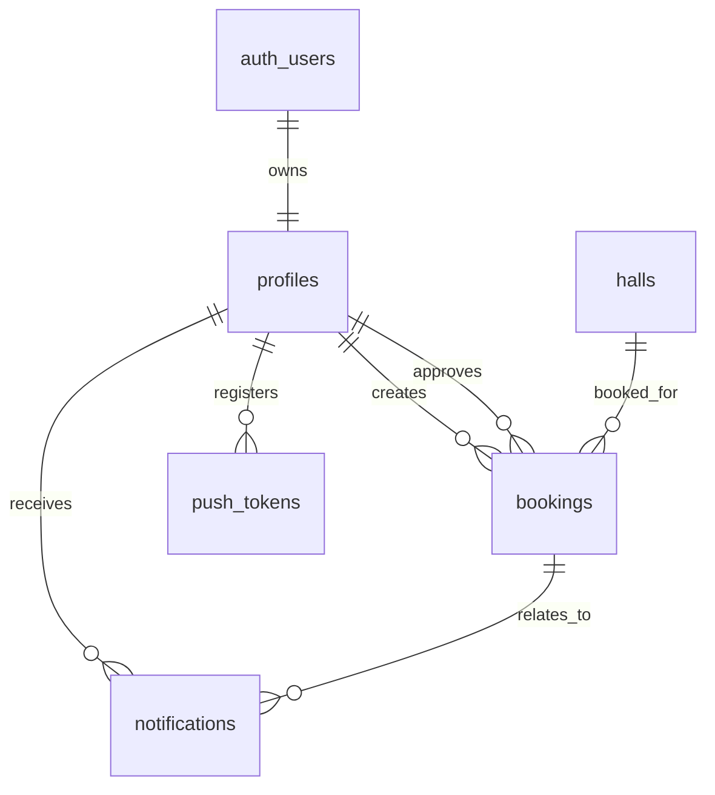

# VenueVerse Supabase Documentation

## Overview

VenueVerse uses Supabase for authentication, PostgreSQL data storage, Row Level Security, RPC functions, triggers, storage, realtime notifications, and Edge Functions.

Source of truth: `supabase/schema.sql`.

## Authentication

| Capability | Implementation |
| --- | --- |
| Account creation | Super admin-only `admin-create-user` Edge Function. Public self-registration is not implemented. |
| Login | `supabase.auth.signInWithPassword`. |
| Logout | `supabase.auth.signOut`. |
| Password reset | `supabase.auth.resetPasswordForEmail`. |
| Password change | Current password verified with `signInWithPassword`, then updated with `supabase.auth.updateUser`. |
| Session restore | `supabase.auth.getSession` and `supabase.auth.onAuthStateChange`. |
| Profile creation | `admin-create-user` creates profiles for admin-created accounts; database trigger `handle_new_user_profile` also exists for Auth user inserts. |

## Tables

### `profiles`

Purpose: Stores app profile data for Supabase Auth users.

| Column | Type | Key/Constraint |
| --- | --- | --- |
| `id` | `uuid` | Primary key, references `auth.users(id)` on delete cascade |
| `full_name` | `text` | Required |
| `email` | `text` | Required, unique |
| `department` | `text` | Optional |
| `role` | `text` | Required, default `user`, check: `user`, `admin`, `super_admin` |
| `register_number` | `text` | Optional; not detected in current admin-created account payload |
| `phone` | `text` | Optional; not detected in current admin-created account payload |
| `created_at` | `timestamp with time zone` | Default `now()` |

### `halls`

Purpose: Stores bookable venues.

| Column | Type | Key/Constraint |
| --- | --- | --- |
| `id` | `uuid` | Primary key, default `gen_random_uuid()` |
| `name` | `text` | Required |
| `department` | `text` | Optional, indexed |
| `venue_type` | `text` | Optional, indexed |
| `location` | `text` | Optional |
| `block` | `text` | Optional |
| `floor` | `text` | Optional |
| `capacity` | `integer` | Required, check `capacity > 0` |
| `facilities` | `text[]` | Optional |
| `image_url` | `text` | Optional |
| `is_active` | `boolean` | Default `true` |
| `created_at` | `timestamp with time zone` | Default `now()` |

### `bookings`

Purpose: Stores booking requests and approval state.

| Column | Type | Key/Constraint |
| --- | --- | --- |
| `id` | `uuid` | Primary key, default `gen_random_uuid()` |
| `hall_id` | `uuid` | References `halls(id)` on delete cascade |
| `user_id` | `uuid` | References `profiles(id)` on delete cascade |
| `event_title` | `text` | Required |
| `event_type` | `text` | Optional |
| `purpose` | `text` | Optional; not detected in current booking insert payload |
| `department` | `text` | Optional |
| `audience_count` | `integer` | Optional, check positive if provided; not detected in current booking insert payload |
| `faculty_coordinator` | `text` | Optional |
| `additional_requirements` | `text` | Optional; not detected in current booking insert payload |
| `start_time` | `timestamp with time zone` | Required |
| `end_time` | `timestamp with time zone` | Required, check `end_time > start_time` |
| `status` | `text` | Required, default `pending`; allowed statuses listed below |
| `admin_remarks` | `text` | Optional |
| `approved_by` | `uuid` | References `profiles(id)` |
| `created_at` | `timestamp with time zone` | Default `now()` |
| `updated_at` | `timestamp with time zone` | Maintained by trigger |

Allowed statuses:

- `pending`
- `approved`
- `rejected`
- `cancelled`
- `completed`

### `notifications`

Purpose: Stores in-app notifications.

| Column | Type | Key/Constraint |
| --- | --- | --- |
| `id` | `uuid` | Primary key, default `gen_random_uuid()` |
| `user_id` | `uuid` | References `profiles(id)` on delete cascade |
| `title` | `text` | Required |
| `message` | `text` | Required |
| `is_read` | `boolean` | Default `false` |
| `booking_id` | `uuid` | References `bookings(id)` on delete set null |
| `created_at` | `timestamp with time zone` | Default `now()` |

### `push_tokens`

Purpose: Stores Expo push tokens for authenticated devices.

| Column | Type | Key/Constraint |
| --- | --- | --- |
| `id` | `uuid` | Primary key, default `gen_random_uuid()` |
| `user_id` | `uuid` | References `profiles(id)` on delete cascade |
| `expo_push_token` | `text` | Required |
| `platform` | `text` | Optional |
| `device_name` | `text` | Optional |
| `created_at` | `timestamp with time zone` | Default `now()` |
| `updated_at` | `timestamp with time zone` | Maintained by trigger |

Unique constraint:

- `(user_id, expo_push_token)`

## Indexes

| Index | Table | Columns |
| --- | --- | --- |
| `bookings_hall_id_idx` | `bookings` | `hall_id` |
| `bookings_user_id_idx` | `bookings` | `user_id` |
| `bookings_status_idx` | `bookings` | `status` |
| `bookings_start_time_idx` | `bookings` | `start_time` |
| `bookings_end_time_idx` | `bookings` | `end_time` |
| `notifications_user_id_idx` | `notifications` | `user_id` |
| `push_tokens_user_id_idx` | `push_tokens` | `user_id` |
| `halls_department_idx` | `halls` | `department` |
| `halls_venue_type_idx` | `halls` | `venue_type` |

## Relationships



## RPC and Database Functions

| Function | Type | Purpose |
| --- | --- | --- |
| `check_booking_overlap` | RPC | Detects pending/approved booking overlap for a hall/time range. |
| `check_approved_booking_overlap` | RPC | Detects approved booking conflicts during approval, excluding the current booking. |
| `get_today_booked_halls` | RPC | Returns today's pending/approved bookings with hall metadata. |
| `set_booking_updated_at` | Trigger helper | Updates `updated_at`. |
| `enforce_booking_overlap_rules` | Trigger helper | Prevents duplicate/conflicting bookings. |
| `is_super_admin` | RLS helper | Checks current user role. |
| `is_admin` | RLS helper | Checks current user role. |
| `is_admin_or_super_admin` | RLS helper | Checks admin-level access. |
| `create_admin_booking_notifications` | RPC | Inserts notifications for admins after a booking request. |
| `prevent_profile_role_update` | Trigger helper | Blocks unauthorized role changes. |
| `handle_new_user_profile` | Trigger helper | Creates profile after Auth user creation. |
| `enforce_booking_update_rules` | Trigger helper | Restricts booking updates by role and status. |
| `enforce_notification_update_rules` | Trigger helper | Restricts notification updates to owner read-state changes. |

## Triggers

| Trigger | Table | Purpose |
| --- | --- | --- |
| `set_booking_updated_at` | `bookings` | Maintains `updated_at`. |
| `set_push_token_updated_at` | `push_tokens` | Maintains `updated_at`. |
| `enforce_booking_overlap_rules` | `bookings` | Blocks conflicting inserts and approved updates. |
| `prevent_profile_role_update` | `profiles` | Prevents non-super-admin role changes. |
| `handle_new_user_profile` | `auth.users` | Creates app profile on Auth user insert. |
| `enforce_booking_update_rules` | `bookings` | Allows users to cancel only own pending bookings and admins to review only. |
| `enforce_notification_update_rules` | `notifications` | Allows users to update only their own notification read state. |

## Row Level Security

RLS is enabled on:

- `profiles`
- `halls`
- `bookings`
- `notifications`
- `push_tokens`

### Policies

| Table | Policies |
| --- | --- |
| `profiles` | `profiles_select_own`, `profiles_select_admin_all`, `profiles_update_own`, `profiles_insert_own_user`, `profiles_update_roles_super_admin` |
| `halls` | `halls_select_active_authenticated`, `halls_select_admin_all`, `halls_insert_admin`, `halls_update_admin`, `halls_delete_super_admin` |
| `bookings` | `bookings_insert_own`, `bookings_select_own`, `bookings_select_admin_all`, `bookings_cancel_own_pending`, `bookings_review_admin` |
| `notifications` | `notifications_select_own`, `notifications_update_read_own`, `notifications_insert_own`, `notifications_insert_admin` |
| `push_tokens` | `push_tokens_manage_own`, `push_tokens_select_admin` |

## Storage

| Bucket | Public | Purpose |
| --- | --- | --- |
| `hall-images` | Yes | Stores venue images uploaded from hall management. |

Storage policies:

- `hall_images_read_authenticated`
- `hall_images_insert_admin`
- `hall_images_update_admin`
- `hall_images_delete_admin`

## Realtime

The schema adds `public.notifications` to the `supabase_realtime` publication. The app subscribes to inserts filtered by the current user's `user_id`.

## Edge Functions

| Function | Purpose | Required Env |
| --- | --- | --- |
| `admin-create-user` | Super admin creates Auth user and profile. | `SUPABASE_URL`, `SUPABASE_SERVICE_ROLE_KEY` |
| `send-push-notification` | Sends Expo push notifications to saved tokens. | `SUPABASE_URL`, `SUPABASE_SERVICE_ROLE_KEY` |

## Setup Checklist

1. Create Supabase project.
2. Run `supabase/schema.sql`.
3. Confirm RLS is enabled.
4. Confirm functions/triggers/policies exist.
5. Confirm `hall-images` bucket exists and is public.
6. Deploy Edge Functions:

```bash
supabase functions deploy send-push-notification
supabase functions deploy admin-create-user
```

7. Configure app environment variables:

```env
EXPO_PUBLIC_SUPABASE_URL=https://your-project.supabase.co
EXPO_PUBLIC_SUPABASE_ANON_KEY=your-anon-key
```

8. Configure EAS project id in `app.json` for production push notifications.
